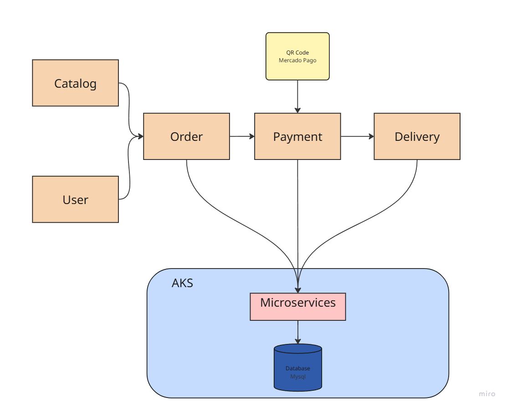
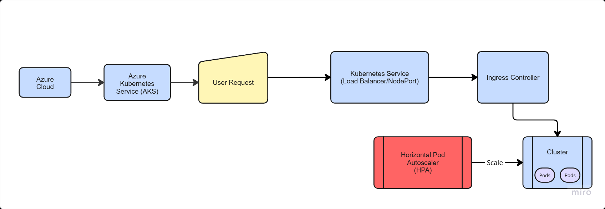

# Lanchonete Na Comanda Project

## Architecture Design

* **Business Requirements**:



* **Infrastructure Requirements**:



## Project Overview

The "Lanchonete Na Comanda" is a self-service system for fast food restaurants, designed to optimize the order, payment, and tracking processes, as well as offer administrative functionalities for the establishment. The main goal is to ensure efficient customer service, properly managing orders and stock, and supporting the expansion of the fast food restaurant without the challenges of a manual system.

This project focuses on backend development, following a hexagonal architecture and providing APIs for various operations. The system is designed to run in a containerized environment using Docker.

## Key Features

The main system features are divided into customer flow and administrative access:

### Customer Flow

* **Ordering**: Customers can identify themselves via CPF, register, or proceed without identification. They can assemble product combos in the following sequences, all optional: Main Course, Side Dish, Drink, and Dessert. At each step, the name, description, and price of each product are displayed.
* **Payment**: The system includes an integrated payment option for the MVP, using a Mercado Pago QR Code.
* **Tracking**: After order confirmation and payment, it is sent to the kitchen, and its progress can be tracked by the customer on a monitor, with the following statuses: Received, In Preparation, Ready, and Finished.
* **Pickup**: When the order is ready, the customer is notified for pickup. After pickup, the order status is updated to "finished".

### Administrative Access

* **Customer Management**: Allows the establishment to manage customer information, enabling future promotional campaigns.
* **Product and Category Management**: The establishment can define and manage product name, category, price, description, and images. Categories are fixed: Main Course, Side Dish, Drink, and Dessert.
* **Order Tracking**: Allows tracking of ongoing orders and their waiting times.
* **Order Management**: Employees can change the status of orders (e.g., "Received", "In Preparation", "Ready", "Finished") as they progress in the kitchen and are delivered.
* **Queue Management**: Employees can monitor the order queue, prioritizing and managing the preparation flow.


## Available APIs (Monolithic Backend)

The backend is developed as a monolith, following a hexagonal architecture. The implemented APIs are:

**Swagger UI Documentation:**
* `Local`: http://localhost:8080/swagger-ui.html
* `Cloud`: http://lanchonete-na-comanda.eastus.cloudapp.azure.com/swagger-ui/index.html

* **Customer Registration**:
    * `POST /customer/save`: Creates a new customer.
    * `PUT /customer/{id}`: Updates an existing customer.
* **Customer Identification via CPF**:
    * `GET /customer/{cpf}`: Retrieves a customer by CPF.
* **Create, Edit, and Remove Products**:
    * `POST /product/save`: Creates new products.
    * `PUT /product/{id}`: Updates an existing product.
    * `DELETE /product/{id}`: Removes a product.
* **Retrieve Products by Category**:
    * `GET /product/category/{category}`: Retrieves products by category.
    * `GET /product`: Lists all products.
* **Order Management**:
    * `POST /order/checkout`: Finalizes the order, sending products to the queue.
    * `GET /order`: Lists all orders (no filters).
    * `GET /order/status/{status}`: Lists orders by status.
    * `GET /order/{id}`: Retrieves an order by ID.
    * `GET /order/activeOrders`: Lists all orders (excluding finished ones, sorted by status and oldest first as per challenge requirements).
    * `PATCH /order/{id}/status/{status}`: Updates an order's status.
    * `PATCH /order/{id}`: Updates an order.
* **Payment Status & Webhook**:
    * `GET /{orderId}/payment-status`: Consults the payment status of an order.
    * `POST /webhooks/payment-confirmation`: Webhook endpoint to receive payment confirmations from Mercado Pago (or mock).

Swagger UI will be available for consuming these APIs.

## Environment Setup

The project uses Docker and Docker Compose to facilitate development and execution environment setup.

### Prerequisites

* **Docker Desktop** (or Docker Engine and Docker Compose installed)
* **Java 17 Development Kit (JDK)**
* **Maven** (for building the Spring Boot application if not using Docker build)
* **(Optional for Kubernetes deployment)** `kubectl` and a Kubernetes cluster (e.g., Minikube, Kind, or a cloud-managed cluster like GKE, EKS, AKS).

### How to Run the Project Locally

1.  **Clone the repository:**
    ```bash
    git clone https://github.com/flaviotmt/techchallengefiap
    cd na.comanda
    ```

2.  **Create a `.env` file in the project root:**
    This file will contain the environment variables for the database and Mercado Pago connection.
    ```
    MYSQL_ROOT_PWD=root_password
    MYSQL_DB=lanchonetenacomanda
    MYSQL_USER=user
    MYSQL_PWD=password
    MERCADOPAGO_CLIENT_ID=111
    MERCADOPAGO_SECRET_ID=ABC123
    ```
    * `MYSQL_ROOT_PWD`: Root user password for MySQL.
    * `MYSQL_DB`: Name of the database to be created.
    * `MYSQL_USER`: Username for database access.
    * `MYSQL_PWD`: Password for the database user.
    * `MERCADOPAGO_CLIENT_ID`: Client Id for you Mercado Pago account.
    * `MERCADOPAGO_SECRET_ID`: Secret Id for you Mercado Pago account.
    

3.  **Start the services with Docker Compose:**
    ```bash
    docker-compose up --build
    ```
    This command will:
    * Build the Spring Boot application image (`app`) from the `Dockerfile`.
    * Pull the MySQL 8.0 image for the `db` service.
    * Create and start the `na-comanda-net` network.
    * Mount volumes for MySQL data persistence (`db-data`).
    * Execute the `init.sql` script in MySQL to create the `customers` and `products` tables and populate them with initial data.
    * Map port `3306` of the MySQL container to port `3306` on your host.
    * Map port `8080` of the Spring Boot application container to port `8080` on your host.

4.  **Access the application:**
    Once the containers are running, the Spring Boot application will be available at:
    `http://localhost:8080`

    And the Swagger UI documentation at:
    `http://localhost:8080/swagger-ui.html`

## Technologies Used

* Java 17
* Spring Boot 3.x
* Maven
* MySQL 8.0
* Docker
* Lombok
* Springdoc OpenAPI (Swagger UI)

## Best Practices and Security

* **Environment Variables:** Database credentials are managed via environment variables (`.env` file) and referenced in `docker-compose.yml` and `application.yml`, preventing direct exposure in code or public configuration files.
* **Fast Initialization:** The `Dockerfile` uses a separate `build` stage to compile the application and copy only the final JAR, resulting in a smaller and more efficient Docker image. Dependencies are downloaded in a separate stage (`mvn dependency:go-offline`) to optimize Docker build caching.
* **Data Persistence:** A Docker volume (`db-data`) is used to ensure that MySQL database data persists even if the container is removed.

## API Usage Flow and Examples

This section provides a guide on how to interact with the APIs, demonstrating a typical customer and administrative flow. All requests should include an optional `Request-Trace-Id` header for traceability.

### 1. Customer Flow Example

#### A. Identify or Register a Customer (Optional)
* **To get a customer by CPF (if already registered):**
    * `GET /customer/{cpf}`
    * Example: `GET http://localhost:8080/customer/12345678900`
* **To create a new customer:**
    * `POST /customer/save`
    * Body:
        ```json
        {
          "cpf": "12345678900",
          "name": "John Doe",
          "email": "john.doe@example.com"
        }
        ```

#### B. Browse Products
* **Get all products:**
    * `GET /product`
* **Get products by category:**
    * `GET /product/category/{category}`
    * Example: `GET http://localhost:8080/product/category/SNACK` (Valid categories: `SNACK`, `SIDE_DISH`, `DRINK`, `DESSERT`)

#### C. Create an Order (Checkout)
* `POST /order/checkout`
* Body (replace `productId` with actual IDs from `/product` endpoint):
    ```json
    {
        "customerCpf": "12345678900",
        "items": [
            {
            "productId": "product-id-1",
            "quantity": 2
            }
        ]
    }
    ```
    * **Response:** This call will return the `orderId` which is crucial for subsequent payment and status checks.

#### D. Simulate Payment Confirmation (Webhook)
* This endpoint is typically called by an external payment gateway (e.g., Mercado Pago) after a payment is processed. For testing, you can simulate this.
* `POST /webhooks/payment-confirmation`
* Body (the `id` in `data` corresponds to the `externalReference` of the order generated during checkout):
    ```json
    {
      "id": "external-payment-reference-from-checkout", 
      "topic": "merchant_order",
      "data": {
        "id": "external-payment-reference-from-checkout"
      }
    }
    ```
    * **Note:** In a real integration, the `id` within `data` would be provided by Mercado Pago. For the mock, you'd use the `externalReference` associated with your created order.

#### E. Consult Payment Status
* `GET /{orderId}/payment-status`
* Example: `GET http://localhost:8080/12345/payment-status` (Use the `orderId` obtained from checkout)

#### F. Track Order Progress (Customer View)
* **Get a specific order by ID:**
    * `GET /order/{id}`
    * Example: `GET http://localhost:8080/order/12345`
* **Get all active orders (customer monitor view, sorted):**
    * `GET /order/activeOrders`

#### G. Update Order to Finished (Pickup)
* Once the customer picks up the order, an administrative action would update its status.
* `PATCH /order/{id}/status/FINISHED`
* Example: `PATCH http://localhost:8080/order/12345/status/FINISHED`

### 2. Administrative Flow Example

#### A. Product Management
* **Create products:**
    * `POST /product/save`
    * Body (list of products):
        ```json
        [
          {
            "itemId": "product-id-1",
            "name": "X-Burger",
            "description": "Delicious beef burger with cheese.",
            "category": "SNACK",
            "price": 15.99
          },
          {
            "itemId": "product-id-2",
            "name": "Coca-Cola",
            "description": "Refreshing soft drink.",
            "category": "DRINK",
            "price": 6.00
          }
        ]
        ```
* **Update a product:**
    * `PUT /product/{id}`
    * Example: `PUT http://localhost:8080/product/product-id-to-update`
    * Body:
        ```json
        {
          "name": "Updated X-Burger",
          "description": "New description.",
          "category": "SNACK",
          "price": 17.50
        }
        ```
* **Delete a product:**
    * `DELETE /product/{id}`
    * Example: `DELETE http://localhost:8080/product/product-id-to-delete`

#### B. Customer Management
* **Update a customer:**
    * `PUT /customer/{id}` (where `id` is the CPF)
    * Example: `PUT http://localhost:8080/customer/12345678900`
    * Body:
        ```json
        {
          "name": "Jane Doe Updated",
          "email": "jane.doe.updated@example.com"
        }
        ```

#### C. Order Monitoring and Status Updates (Kitchen/Admin)
* **List all orders (including finished ones if needed for audit, but `/order` currently only shows active):**
    * `GET /order`
* **List orders by specific status:**
    * `GET /order/status/{status}`
    * Example: `GET http://localhost:8080/order/status/RECEIVED`
    * Valid statuses: `WAITING_PAYMENT`, `RECEIVED`, `IN_PREPARATION`, `READY`, `FINISHED`, `CANCELLED`

* **Update order status (e.g., by kitchen staff):**
    * `PATCH /order/{id}/status/{status}`
    * Example: `PATCH http://localhost:8080/order/12345/status/IN_PREPARATION`
